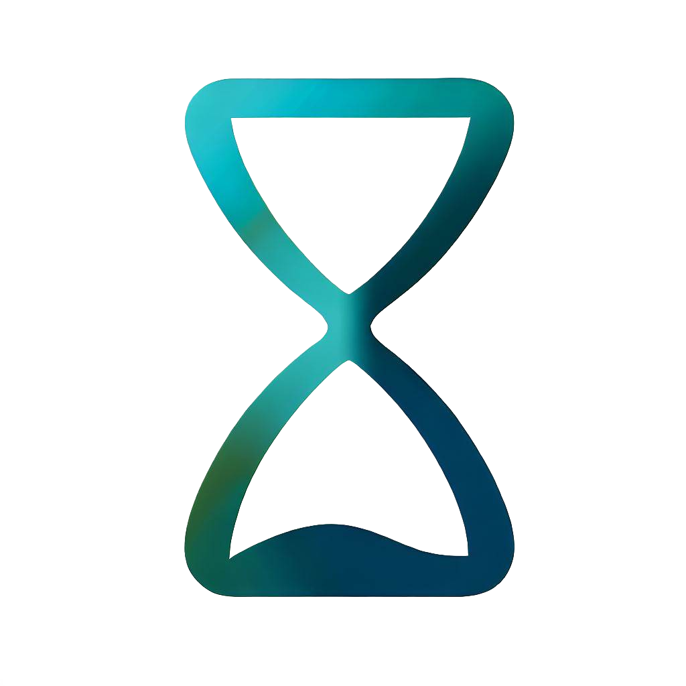

#  Final Countdown JS

Final Countdown JS is a react hook library to handle all kinds of timers.

## Installation

You can use npm, yarn or pnpm to install Final Countdown JS.

```
npm install final-countdown-js
```

```
yarn add final-countdown-js
```

```
pnpm install final-countdown-js
```

## Hooks

### useCountDown

The useCountDown hook provides a simple countdown timer functionality.

It takes three arguments:

- `min` (number): the initial value of the counter.
- `max`(number): the final value of the counter. It has to be greater than `min`.
- `startPaused` (optional boolean): a boolean flag that determines whether the counter should start in a paused state. Defaults to false.

It returns an object with the following props:

- `current`: an object holding the current time of the counter in both leading zero and non-leading zero formats. This object has two properties:
  - `withLeadingZero`: a string indicating the current time of the counter with leading zeroes where necessary.
  - `withoutLeadingZero`: a string indicating the current time of the counter without leading zeros.
- `isPaused`: a boolean value indicating if the counter is currently paused.
- `isOver`: a boolean value indicating if the counter has finished running.
- `pause`: a function that, when called, will pause the counter.
- `play`: a function that, when called, will resume (or start) the counter.
- `reset`: a function that, when called, will reset the counter.
- `togglePause`: a function that, when called, will toggle between pausing and playing the counter.

Example:

```js
import { useCountDown } from "final-countdown-js";

const ReactCounter = () => {
  const counter = useCountDown(0, 10);

  return (
    <div>
      <p>Counter value: {counter.current.withLeadingZero}</p>
      <p>Counter value: {counter.current.withoutLeadingZero}</p>
      <p>Is the counter paused? {counter.isPaused ? "Yes" : "No"}</p>
      <p>Has the counter over? {counter.isOver ? "Yes" : "No"}</p>
      <button onClick={counter.pause}>Pause</button>
      <button onClick={counter.play}>Play</button>
      <button onClick={counter.reset}>Reset</button>
      <button onClick={counter.togglePause}>Toggle Pause</button>
    </div>
  );
};

export default ReactCounter;
```

### useCountUp

The useCountUp hook provides a simple countup timer functionality.

It takes three arguments:

- `min` (number): the initial value of the counter.
- `max`(number): the final value of the counter. It has to be greater than `min`.
- `startPaused` (optional boolean): a boolean flag that determines whether the counter should start in a paused state. Defaults to false.

It returns an object with the following props:

- `current`: an object holding the current time of the counter in both leading zero and non-leading zero formats. This object has two properties:
  - `withLeadingZero`: a string indicating the current time of the counter with leading zeroes where necessary.
  - `withoutLeadingZero`: a string indicating the current time of the counter without leading zeros.
- `isPaused`: a boolean value indicating if the counter is currently paused.
- `isOver`: a boolean value indicating if the counter has finished running.
- `pause`: a function that, when called, will pause the counter.
- `play`: a function that, when called, will resume (or start) the counter.
- `reset`: a function that, when called, will reset the counter.
- `togglePause`: a function that, when called, will toggle between pausing and playing the counter.

Example:

```js
import { useCountUp } from "final-countdown-js";

const ReactCounter = () => {
  const counter = useCountDown(0, 10);

  return (
    <div>
      <p>Counter value: {counter.current.withLeadingZero}</p>
      <p>Counter value: {counter.current.withoutLeadingZero}</p>
      <p>Is the counter paused? {counter.isPaused ? "Yes" : "No"}</p>
      <p>Has the counter over? {counter.isOver ? "Yes" : "No"}</p>
      <button onClick={counter.pause}>Pause</button>
      <button onClick={counter.play}>Play</button>
      <button onClick={counter.reset}>Reset</button>
      <button onClick={counter.togglePause}>Toggle Pause</button>
    </div>
  );
};

export default ReactCounter;
```

### useStopwatch

The useStopwatch hook provides stopwatch functionality with a limit.

It takes six arguments:

- `days` (number): the final value of the days. It has to be equal to or greater than 0.
- `hours` (number): the final value of the hours. The value must be between 0 (inclusive) and 24 (exclusive).
- `minutes` (number): the final value of the minutes. The value must be between 0 (inclusive) and 60 (exclusive).
- `seconds` (number): the final value of the seconds. The value must be between 0 (inclusive) and 60 (exclusive).
- `startPaused` (optional boolean): a boolean flag that determines whether the stopwatch should start in a paused state. Defaults to false.
- `separator` (optional string): a string that specifies the separator to be used between days, hours, minutes, and seconds when the time is represented as a string. By default, colon (:) is used as a separator.

It returns an object with the following props:

- `current`: an object holding the current time of the stopwatch in both leading zero and non-leading zero formats. This object has two properties:
  - `withLeadingZero`: a string indicating the current time of the stopwatch with leading zeroes where necessary.
  - `withoutLeadingZero`: a string indicating the current time of the stopwatch without leading zeros.
- `isPaused`: a boolean value indicating if the stopwatch is currently paused.
- `isOver`: a boolean value indicating if the stopwatch has finished running.
- `currentDays`: a number indicating the current value of the days on the stopwatch.
- `currentHours`: a number indicating the current value of the hours on the stopwatch.
- `currentMinutes`: a number indicating the current value of the minutes on the stopwatch.
- `currentSeconds`: a number indicating the current value of the seconds on the stopwatch.
- `elapsedSeconds`: a number indicating the total elapsed time, calculated in seconds, since the stopwatch started.
- `remainingSeconds`: a number indicating the total remaining time, calculated in seconds, until the stopwatch reaches the initially set time.
- `remainingTime`: analogous to the `current` object, this object holds the remaining time in both formats:
  - `withLeadingZero`: a string indicating the remaining time with leading zeroes.
  - `withoutLeadingZero`: a string indicating the remaining time without leading zeroes.
- `pause`: a function that, when called, will pause the stopwatch.
- `play`: a function that, when called, will resume (or start) the stopwatch.
- `reset`: a function that, when called, will reset the stopwatch.
- `togglePause`: a function that, when called, will toggle between pausing and playing the stopwatch.

Example:

```js
import { useStopwatch } from "final-countdown-js";

const ReactCounter = () => {
  const stopwatch = useStopwatch(1, 0, 10, 50);

  return (
    <div>
      <p>Stopwatch value: {stopwatch.current.withLeadingZero}</p>
      <p>Stopwatch value: {stopwatch.current.withoutLeadingZero}</p>
      <p>Remaining time: {stopwatch.remainingTime.withLeadingZero}</p>
      <p>Remaining time: {stopwatch.remainingTime.withoutLeadingZero}</p>
      <p>Days: {stopwatch.currentDays}</p>
      <p>Hours: {stopwatch.currentHours}</p>
      <p>Minutes: {stopwatch.currentMinutes}</p>
      <p>Seconds: {stopwatch.currentSeconds}</p>
      <p>Elapsed seconds: {stopwatch.elapsedSeconds}</p>
      <p>Remaining seconds: {stopwatch.remainingSeconds}</p>
      <p>Is the counter paused? {stopwatch.isPaused ? "Yes" : "No"}</p>
      <p>Has the counter over? {stopwatch.isOver ? "Yes" : "No"}</p>
      <button onClick={stopwatch.pause}>Pause</button>
      <button onClick={stopwatch.play}>Play</button>
      <button onClick={stopwatch.reset}>Reset</button>
      <button onClick={stopwatch.togglePause}>Toggle Pause</button>
    </div>
  );
};

export default ReactCounter;
```

### useUnlimitedStopwatch

The useStopwatch hook provides unlimited stopwatch functionality.

It takes two arguments:

- `startPaused` (optional boolean): a boolean flag that determines whether the stopwatch should start in a paused state. Defaults to false.
- `separator` (optional string): a string that specifies the separator to be used between days, hours, minutes, and seconds when the time is represented as a string. By default, colon (:) is used as a separator.

It returns an object with the following props:

- `current`: an object holding the current time of the stopwatch in both leading zero and non-leading zero formats. This object has two properties:
  - `withLeadingZero`: a string indicating the current time of the stopwatch with leading zeroes where necessary.
  - `withoutLeadingZero`: a string indicating the current time of the stopwatch without leading zeros.
- `isPaused`: a boolean value indicating if the stopwatch is currently paused.
- `currentDays`: a number indicating the current value of the days on the stopwatch.
- `currentHours`: a number indicating the current value of the hours on the stopwatch.
- `currentMinutes`: a number indicating the current value of the minutes on the stopwatch.
- `currentSeconds`: a number indicating the current value of the seconds on the stopwatch.
- `elapsedSeconds`: a number indicating the total elapsed time, calculated in seconds, since the stopwatch started.
- `pause`: a function that, when called, will pause the stopwatch.
- `play`: a function that, when called, will resume (or start) the stopwatch.
- `reset`: a function that, when called, will reset the stopwatch.
- `togglePause`: a function that, when called, will toggle between pausing and playing the stopwatch.

Example:

```js
import { useUnlimitedStopwatch } from "final-countdown-js";

const ReactCounter = () => {
  const stopwatch = useUnlimitedStopwatch();

  return (
    <div>
      <p>Counter value: {stopwatch.current.withLeadingZero}</p>
      <p>Counter value: {stopwatch.current.withoutLeadingZero}</p>
      <p>Days: {stopwatch.currentDays}</p>
      <p>Hours: {stopwatch.currentHours}</p>
      <p>Minutes: {stopwatch.currentMinutes}</p>
      <p>Seconds: {stopwatch.currentSeconds}</p>
      <p>Elapsed seconds: {stopwatch.elapsedSeconds}</p>
      <p>Is the counter paused? {stopwatch.isPaused ? "Yes" : "No"}</p>
      <button onClick={stopwatch.pause}>Pause</button>
      <button onClick={stopwatch.play}>Play</button>
      <button onClick={stopwatch.reset}>Reset</button>
      <button onClick={stopwatch.togglePause}>Toggle Pause</button>
    </div>
  );
};

export default ReactCounter;
```

### useTimer

The useTimer hook provides timer functionality.

It takes six arguments:

- `days` (number): the initial value of the days. It has to be equal to or greater than 0.
- `hours` (number): the initial value of the hours. The value must be between 0 (inclusive) and 24 (exclusive).
- `minutes` (number): the initial value of the minutes. The value must be between 0 (inclusive) and 60 (exclusive).
- `seconds` (number): the initial value of the seconds. The value must be between 0 (inclusive) and 60 (exclusive).
- `startPaused` (optional boolean): a boolean flag that determines whether the timer should start in a paused state. Defaults to false.
- `separator` (optional string): a string that specifies the separator to be used between days, hours, minutes, and seconds when the time is represented as a string. By default, colon (:) is used as a separator.

It returns an object with the following props:

- `current`: an object holding the current time of the timer in both leading zero and non-leading zero formats. This object has two properties:
  - `withLeadingZero`: a string indicating the current time of the timer with leading zeroes where necessary.
  - `withoutLeadingZero`: a string indicating the current time of the timer without leading zeros.
- `isPaused`: a boolean value indicating if the timer is currently paused.
- `isOver`: a boolean value indicating if the timer has finished running.
- `currentDays`: a number indicating the current value of the days on the timer.
- `currentHours`: a number indicating the current value of the hours on the timer.
- `currentMinutes`: a number indicating the current value of the minutes on the timer.
- `currentSeconds`: a number indicating the current value of the seconds on the timer.
- `elapsedSeconds`: a number indicating the total elapsed time, calculated in seconds, since the timer started.
- `remainingSeconds`: a number indicating the total remaining time, calculated in seconds, until the timer reaches the initially set time.
- `elapsedTime`: analogous to the `current` object, this object holds the elapsed time in both formats:
  - `withLeadingZero`: a string indicating the elapsed time with leading zeroes.
  - `withoutLeadingZero`: a string indicating the elapsed time without leading zeroes.
- `pause`: a function that, when called, will pause the timer.
- `play`: a function that, when called, will resume (or start) the timer.
- `reset`: a function that, when called, will reset the timer.
- `togglePause`: a function that, when called, will toggle between pausing and playing the timer.

Example:

```js
import { useTimer } from "final-countdown-js";

const ReactCounter = () => {
  const timer = useTimer(0, 10, 50);

  return (
    <div>
      <p>Timer value: {timer.current.withLeadingZero}</p>
      <p>Timer value: {timer.current.withoutLeadingZero}</p>
      <p>Elapsed time: {timer.elapsedTime.withLeadingZero}</p>
      <p>Elapsed time: {timer.elapsedTime.withoutLeadingZero}</p>
      <p>Days: {timer.currentDays}</p>
      <p>Hours: {timer.currentHours}</p>
      <p>Minutes: {timer.currentMinutes}</p>
      <p>Seconds: {timer.currentSeconds}</p>
      <p>Elapsed seconds: {timer.elapsedSeconds}</p>
      <p>Remaining seconds: {timer.remainingSeconds}</p>
      <p>Is the counter paused? {timer.isPaused ? "Yes" : "No"}</p>
      <p>Has the counter over? {timer.isOver ? "Yes" : "No"}</p>
      <button onClick={timer.pause}>Pause</button>
      <button onClick={timer.play}>Play</button>
      <button onClick={timer.reset}>Reset</button>
      <button onClick={timer.togglePause}>Toggle Pause</button>
    </div>
  );
};

export default ReactCounter;
```

## Guides

- [Full guide in Spanish](https://www.dlcastillop.com/blog/dominando-final-countdown-js-una-gu%C3%ADa-completa/)

## Contributions

If you're interested in contributing to Final Countdown JS, please read our [contributing docs](https://github.com/dlcastillop/final-countdown-js/blob/main/CONTRIBUTING.md) before submitting a pull request.

## Support

Don't forget to leave a star!
